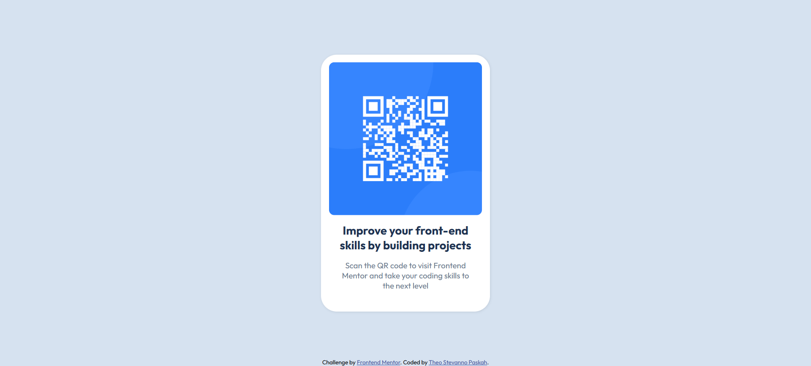

# Frontend Mentor - QR code component solution

This is a solution to the [QR code component challenge on Frontend Mentor](https://www.frontendmentor.io/challenges/qr-code-component-iux_sIO_H). Frontend Mentor challenges help you improve your coding skills by building realistic projects. 

## Table of contents

- [Overview](#overview)
  - [Screenshot](#screenshot)
  - [Links](#links)
- [My process](#my-process)
  - [Built with](#built-with)
  - [What I learned](#what-i-learned)
  - [Continued development](#continued-development)
  - [Useful resources](#useful-resources)
- [Author](#author)
- [Acknowledgments](#acknowledgments)

**Note: Delete this note and update the table of contents based on what sections you keep.**

## Overview

I did this project to sharpen my HTML and CSS skills. It was the first time i built a website without tutorial to follow with. I hoped this project could be a learning experience and review the mistakes i made.

### Screenshot



### Links

- Solution URL: [Add solution URL here](https://your-solution-url.com)
- Live Site URL: [Add live site URL here](https://your-live-site-url.com)

## My process

### Built with

- Semantic HTML5 markup
- CSS custom properties
- Flexbox

### What I learned
I learned 2 things from this project.

### Transform and inline-flex
I created a container that adjusts to the HTML content using inline-flex and used transform to center the container on the page.
I learned how to use inline-flex and transform. 

```css
.qrcode-container {
    background-color: white;
    border-radius: 30px;
    box-shadow: 1px 1px 5px rgba(0, 0, 0, 0.1);
    position: absolute;
    top: 50%;
    left: 50%;
    transform: translate(-50%, -50%);

    padding-top: 15px;
    padding-left: 15px;
    padding-right: 15px;
    padding-bottom: 25px;
    display: inline-flex;
    flex-direction: column;
    justify-content: center;
    align-items: center;
}
```

### Continued development

Although i used inline-flex on the container to make it adjust to the html content, i am unsure if it is the right situation to use it in. With centering an element or container to the middle of the screen, i am unsure if it is the most efficient way to use it. I want to improve my solutions to these problems in the future.

### Useful resources

- [Supersimpledev](https://www.youtube.com/@SuperSimpleDev) - This helped me for learning the basics of html and css aswell as git. I really liked this channel and will use it going forward.
- [vanzasetia](https://github.com/vanzasetia/designo-multi-page-website#author) - This repository helped me with how to write README.md and will continue using it as a guide going forward.

## Author

- Website - [Theo Stevanno Paskah](https://www.your-site.com)
- Frontend Mentor - [@Heromunchen](https://www.frontendmentor.io/profile/yourusername)